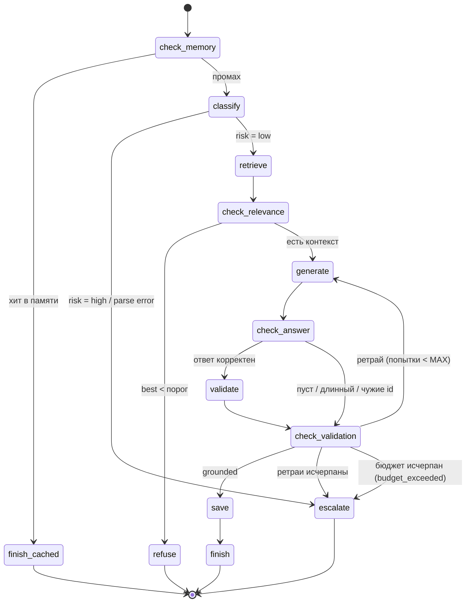

# DZ_6: Контроль качества агента — пайплайн тикета + метрики, бюджет, лог

Базовый сценарий — порт DZ_5: запрос пользователя обрабатывается как
**сценарий из 5 шагов** с точками ветвления на **графе состояний**, с
**векторным поиском контекста** (Qdrant) и **граф-памятью Q&A**.
В DZ_6 поверх сценария добавлен **контрольный слой**:

1. **Метрики** — `RunMetrics` на каждый прогон: успех (outcome), длительность,
   LLM-вызовы, токены (prompt/completion/total), ретраи, нарушение бюджета.
2. **Ограничение** — `BudgetGuard` (преодохранитель): не более
   `MAX_LLM_CALLS_PER_RUN` (6) LLM-вызовов за прогон; превышение — эскалация
   `budget_exceeded`, а не падение. Плюс retry с backoff (0.5с/1.5с) только на
   транзиентные сетевые ошибки LLM (`APIConnectionError`/`APITimeoutError`).
3. **Проверка ответа** — новое состояние `check_answer` (13-е в графе, между
   `generate` и `validate`): детерминированная проверка без LLM — ответ
   непустой, длина ≤ `MAX_ANSWER_CHARS`, id в `[источники: …]` существуют в БЗ
   (защита от «галлюцинированных» источников). При провале — обычные ретраи,
   финальная причина эскалации — `answer_check_failed`.
4. **Лог выполнения** — `logs/runs.jsonl` (JSONL, одна строка на прогон:
   ts, query, outcome, причина, trace, время, вызовы, токены, ретраи,
   memory_saved, sources) + сводная таблица метрик в `--demo` + агрегаты
   в `--report`.

## Схема (граф состояний, 13 состояний)



Happy path: `check_memory → classify → retrieve → check_relevance → generate
→ check_answer → validate → check_validation → save → finish`.

## Структура

```
agent.py              # движок графа, сценарий (13 состояний), Qdrant-память,
                      # контрольный слой (метрики/бюджет/retry/лог), CLI, selftest
context/kb.json       # база знаний: 7 документов (формат DZ_3)
memory/qa.json        # граф-память Q&A (заполняется при прогонах)
logs/runs.jsonl       # лог выполнения (JSONL) — часть сдачи
docker-compose.yml    # Qdrant (Docker, порт 6333)
requirements.txt      # openai, python-dotenv, qdrant-client (pinned)
.env.example          # шаблон конфигурации
plan.md               # план реализации
```

## Требования

- Python 3.12+ (разработано и проверено на 3.13).
- OpenAI-совместимый LLM-сервер (LM Studio, дефолт `http://localhost:1234/v1`)
  с чат-моделью (например, `google/gemma-4-12b-qat`) и embedding-моделью
  (например, `text-embedding-qwen3-embedding-0.6b`).
- Qdrant — Docker-контейнер на `localhost:6333`:

  ```bash
  docker compose up -d            # или: docker run -d --name qdrant -p 6333:6333 qdrant/qdrant
  ```

- Если Qdrant или LLM недоступны — агент не падает: поиск деградирует до
  мок-памяти (детерминированные псевдо-векторы), сетевые ошибки LLM ретраятся,
  а при исчерпании ретраев/бюджета — эскалация с причиной, а не traceback.
  Selftest работает вообще без LLM, Qdrant и сети.

## Установка

```bash
cd DZ_6
python3.13 -m venv .venv
.venv/bin/pip install -r requirements.txt
cp .env.example .env          # затем вписать LLM_MODEL / EMBEDDING_MODEL из LM Studio
docker compose up -d          # Qdrant
```

## Запуск

```bash
# интерактивный режим (exit/quit/выход — выход; каждый прогон пишется в runs.jsonl)
.venv/bin/python agent.py

# один вопрос (+ строка метрик, запись в runs.jsonl)
.venv/bin/python agent.py "когда дедлайн по домашним заданиям?"

# один вопрос с путём по состояниям
.venv/bin/python agent.py --show-trace "когда дедлайн по домашним заданиям?"

# сценарный прогон: 4 запроса, все ветки графа + сводная таблица метрик
.venv/bin/python agent.py --demo

# самодиагностика без LLM, Qdrant и сети (10 проверок)
.venv/bin/python agent.py --selftest

# агрегированные метрики по всему logs/runs.jsonl
.venv/bin/python agent.py --report
```

> Чтобы прогнать `--demo` с чистого листа, сбросьте `memory/qa.json` в
> `{"nodes": [], "edges": []}` и удалите `logs/runs.jsonl` — иначе прогон 1
> станет хитом в памяти, а в логе будут дубли.

## Пример выполнения (живой прогон `--demo`, LM Studio + Qdrant)

```text
Эмбеддинги: text-embedding-qwen3-embedding-0.6b (dim=1024)
Qdrant: dz6_memory загружено (7 документов)
Агент DZ_6 | БЗ: 7 документов | память: 0 обработанных вопросов | модель=google/gemma-4-12b-qat
Демо: 4 прогона (все ветки графа состояний)

===== Прогон 1/4: happy path: полный путь + сохранение в память =====
Запрос: Как получить сертификат об окончании курса?
Путь по состояниям: check_memory → classify → retrieve → check_relevance → generate → check_answer → validate → check_validation → save → finish
[answered]
Чтобы получить сертификат об окончании курса, необходимо сдать все домашние задания и пройти итоговую работу на минимальный проходной балл. Получить сертификат можно в личном кабинете после завершения курса, обычно в течение 5 рабочих дней.

[источники: doc-certificate]
Источники: doc-certificate, doc-enroll, doc-mentor
Сохранено в память (qa.json).
Метрики: 97.12с | LLM-вызовов: 3 | токены: 2251 (prompt=883, completion=1368) | ретраев: 0

===== Прогон 2/4: нет контекста → ветка refuse =====
Запрос: Какая погода в Токио?
Путь по состояниям: check_memory → classify → retrieve → check_relevance → refuse
[refused]
В базе знаний не нашлось релевантной информации. Попробуйте переформулировать вопрос или обратитесь к ментору.
Метрики: 38.78с | LLM-вызовов: 1 | токены: 779 (prompt=209, completion=570) | ретраев: 0

===== Прогон 3/4: высокий риск → ветка escalate =====
Запрос: Я хочу на вас подать в суд и причинить вред себе.
Путь по состояниям: check_memory → classify → escalate
[escalated]
Передаю ваш запрос оператору поддержки.
Причина: high_risk
Метрики: 39.28с | LLM-вызовов: 1 | токены: 779 (prompt=215, completion=564) | ретраев: 0

===== Прогон 4/4: повтор вопроса 1 → хит в памяти =====
Запрос: Как получить сертификат об окончании курса?
Путь по состояниям: check_memory → finish_cached
[answered_cached]
(ответ из памяти) Чтобы получить сертификат об окончании курса, необходимо сдать все домашние задания и пройти итоговую работу на минимальный проходной балл. Получить сертификат можно в личном кабинете после завершения курса, обычно в течение 5 рабочих дней.

[источники: doc-certificate]
Источники: doc-certificate, doc-enroll, doc-mentor
Метрики: 0.00с | LLM-вызовов: 0 | токены: 0 (prompt=0, completion=0) | ретраев: 0

===== Сводка метрик =====
№   результат           LLM   токены     время   ретраи  комментарий
1   answered              3     2251    97.12с        0  happy path: полный путь + сохранение в память
2   refused               1      779    38.78с        0  нет контекста → ветка refuse
3   escalated             1      779    39.28с        0  high_risk
4   answered_cached       0        0     0.00с        0  повтор вопроса 1 → хит в памяти
Успешность: 2/4 (50.0%) | отказов: 1 | ошибок: 1
Среднее время: 43.80с | суммарные токены: 3809 | ретраев: 0
```

Те же 4 прогона зафиксированы в `logs/runs.jsonl` (часть сдачи), агрегаты по
логам:

```text
$ .venv/bin/python agent.py --report
Отчёт по логам выполнения: .../DZ_6/logs/runs.jsonl (всего 4 прогонов)
результат          прогонов     доля   среднее время    токенов
answered                  1    25.0%          97.12с       2251
answered_cached           1    25.0%           0.00с          0
refused                   1    25.0%          38.78с        779
escalated                 1    25.0%          39.28с        779
Успешность: 2/4 (50.0%)
Суммарно: время 175.19с, токенов 3809, ретраев 0, эскалаций по бюджету 0
```

«Успешность 50%» в демо — ожидаемо: прогон 2 (refuse) — нормальный отказ,
прогон 3 (high_risk) — запланированная эскалация; по-настоящему «провалились»
0 прогонов.

## Архитектура

```
CLI (agent.py): интерактив | "вопрос" | --demo | --selftest | --report | --show-trace
  |
  v
make_vector_memory(client, kb)
  |  LLM-эмбеддинги (embeddings.create) → QdrantMemory (cosine, dz6_memory)
  |  Qdrant недоступен → MockQdrantMemory (косинус в памяти, те же эмбеддинги)
  |  LLM недоступен → детерминированные псевдо-векторы (_random_embed)
  |
  v
MeteredChat(make_openai_chat(client))            ← контрольный слой
  |  BudgetGuard: перед каждым вызовом llm_calls < MAX_LLM_CALLS_PER_RUN,
  |  иначе BudgetExceeded; retry с backoff 0.5/1.5с на APIConnectionError/
  |  APITimeoutError до LLM_MAX_RETRIES; токены из usage (фолбэк len//4)
  |
  v
build_scenario(meter, kb, memory, qmem, qa_path, config)  →  Workflow(13 состояний)
  |
  |  Workflow.run(ctx): entry → action(ctx) → route(ctx) → ... → END
  |  каждый шаг пишется в ctx.trace; гард MAX_STEPS от зацикливания;
  |  BudgetExceeded в action → escalate (budget_exceeded);
  |  другое исключение → escalate (step_error:<state>) — не падение
  |
  |  5 рабочих шагов:      classify → retrieve → generate → validate → save
  |  (retrieve — векторный поиск top-3 по Qdrant/моку)
  |  5 точек ветвления:    check_memory / classify(risk) / check_relevance /
  |                        check_answer / check_validation (ретрай-цикл с лимитом)
  |  4 терминальных:       finish / refuse / escalate / finish_cached
  |
  v
AgentResult + RunMetrics → RunLog (logs/runs.jsonl, JSONL, append)
```

Ключевые решения:

- **Движок отделён от сценария.** `Workflow` знает только «иди по графу с
  гардами по шагам и бюджету»; сценарий — 13 замыканий в `build_scenario`.
- **Метрикация на шве LLM.** `MeteredChat` оборачивает любой `RawChatFn`
  (реальный клиент или FakeLLM): считает вызовы, токены и ретраи независимо
  от сценария; сценарий видит обычный `ChatFn(system, user) -> str`.
- **Бюджет — предохранитель, а не ошибка.** `BudgetGuard.before_call()` перед
  каждой попыткой (включая повторные после сетевой ошибки); `BudgetExceeded`
  перехватывается движком → `ESCALATED(budget_exceeded)`. Дефолт 6 подобран так,
  что «честный» прогон с ретраями валидации (до 7 вызовов) упирается именно в
  бюджет.
- **Retry только на транзиентные ошибки.** `APIConnectionError`/
  `APITimeoutError` ретраются (backoff 0.5с/1.5с); 4xx и прочие ошибки не
  ретраются, чтобы не маскировать реальные сбои. Каждая попытка учитывается
  в бюджете.
- **Две проверки ответа.** `check_answer` (новый, детерминированный, без LLM):
  пустота, длина ≤ `MAX_ANSWER_CHARS`, источники из `[источники: …]` существуют
  в БЗ; затем LLM-валидатор grounding-фактов. Обе используют общий
  ретрай-механизм, но причины эскалации разные: `answer_check_failed` /
  `grounding_validation_failed`.
- **Токены: usage или оценка `len//4`.** Не все OpenAI-совместимые серверы
  возвращают usage — фолбэк-оценка по той же формуле и для реального клиента,
  и для FakeLLM (детерминизм selftest).
- **Лог — часть сдачи.** Каждый прогон (одиночный, интерактив, демо) дописывает
  одну JSON-строку в `logs/runs.jsonl`; selftest пишет только в tmp-каталог.
- **Selftest без инфраструктуры.** `FakeLLM` (режимы `default`/`risky`/
  `ungrounded`/`loop`/`flaky`/`badformat`) + `MockQdrantMemory` с TF-IDF:
  все ветки графа + бюджет + retry + check_answer проверяются без LLM,
  без Qdrant, без сети.

## Конфигурация (`.env`)

| Переменная | Дефолт | Назначение |
|---|---|---|
| `LLM_BASE_URL` | `http://localhost:1234/v1` | адрес OpenAI-совместимого сервера |
| `LLM_API_KEY` | `lm-studio` | ключ (для LM Studio — любое непустое) |
| `LLM_MODEL` | `google/gemma-4-12b-qat` | Model Identifier чат-модели |
| `LLM_REQUEST_TIMEOUT_SECONDS` | `120` | таймаут запроса к LLM |
| `EMBEDDING_MODEL` | `text-embedding-qwen3-embedding-0.6b` | Model Identifier embedding-модели |
| `EMBEDDING_DIM` | `1024` | размерность вектора (должна совпадать с моделью и коллекцией) |
| `QDRANT_URL` | `http://localhost:6333` | адрес Qdrant |
| `QDRANT_COLLECTION` | `dz6_memory` | имя коллекции (создаётся автоматически, cosine) |
| `KB_FILE` | `context/kb.json` | база знаний (документы для векторного поиска) |
| `QA_MEMORY_FILE` | `memory/qa.json` | граф-память Q&A |
| `RELEVANCE_THRESHOLD` | `0.3` | порог косинусного сходства (ниже — refuse) |
| `MEMORY_HIT_THRESHOLD` | `1.5` | порог keyword-совпадения с вопросом из памяти (выше — finish_cached) |
| `MAX_VALIDATION_RETRIES` | `2` | сколько раз перегенерировать после провала проверки/валидации |
| `MAX_STEPS` | `15` | гард: максимум состояний за один прогон |
| `MAX_LLM_CALLS_PER_RUN` | `6` | предохранитель: максимум LLM-вызовов за прогон |
| `LLM_MAX_RETRIES` | `2` | retry с backoff на сетевые ошибки LLM |
| `MAX_ANSWER_CHARS` | `2000` | лимит длины ответа для `check_answer` |
| `RUNS_LOG_FILE` | `logs/runs.jsonl` | файл лога выполнения (JSONL) |
| `LOG_LEVEL` | `ERROR` | уровень логирования |

## Selftest (без LLM и Qdrant)

`.venv/bin/python agent.py --selftest` — 10 проверок, LLM-сервер, Qdrant и сеть
**не нужны** (FakeLLM + мок Qdrant + детерминированный TF-IDF эмбеддер):

1. граф валиден: все 13 состояний достижимы, переходов в «фантазии» нет;
2. success path: точный trace с `check_answer`, ответ, сохранение в память,
   ребро `qa → doc-certificate`;
3. ветка «нет контекста»: отказ, память не пополняется;
4. провал валидации: `ungrounded` + `retries=1` → эскалация
   `grounding_validation_failed`, бюджет не трогается (5 вызовов < 6);
5. высокий риск: эскалация `high_risk` после классификации, без генерации;
6. хит в памяти: ответ из памяти, без новой генерации и LLM-вызовов;
7. гард `MAX_STEPS`: бесконечный ретрай останавливается;
8. бюджет: `ungrounded` + `MAX_LLM_CALLS_PER_RUN=4` → эскалация
   `budget_exceeded`, ровно 4 LLM-вызова, запись с `llm_calls=4` в tmp-логе;
9. retry: режим `flaky` (первые 2 вызова — имитация сетевой ошибки) →
   3 попытки, `ANSWERED`, ретраев 2;
10. check_answer: режим `badformat` (ответ с несуществующим `doc-fake` в
    источниках) → ретраи → эскалация `answer_check_failed`, LLM-валидатор
    не вызывается.

Успех = `SELF-TEST: все проверки пройдены.` и код возврата 0.